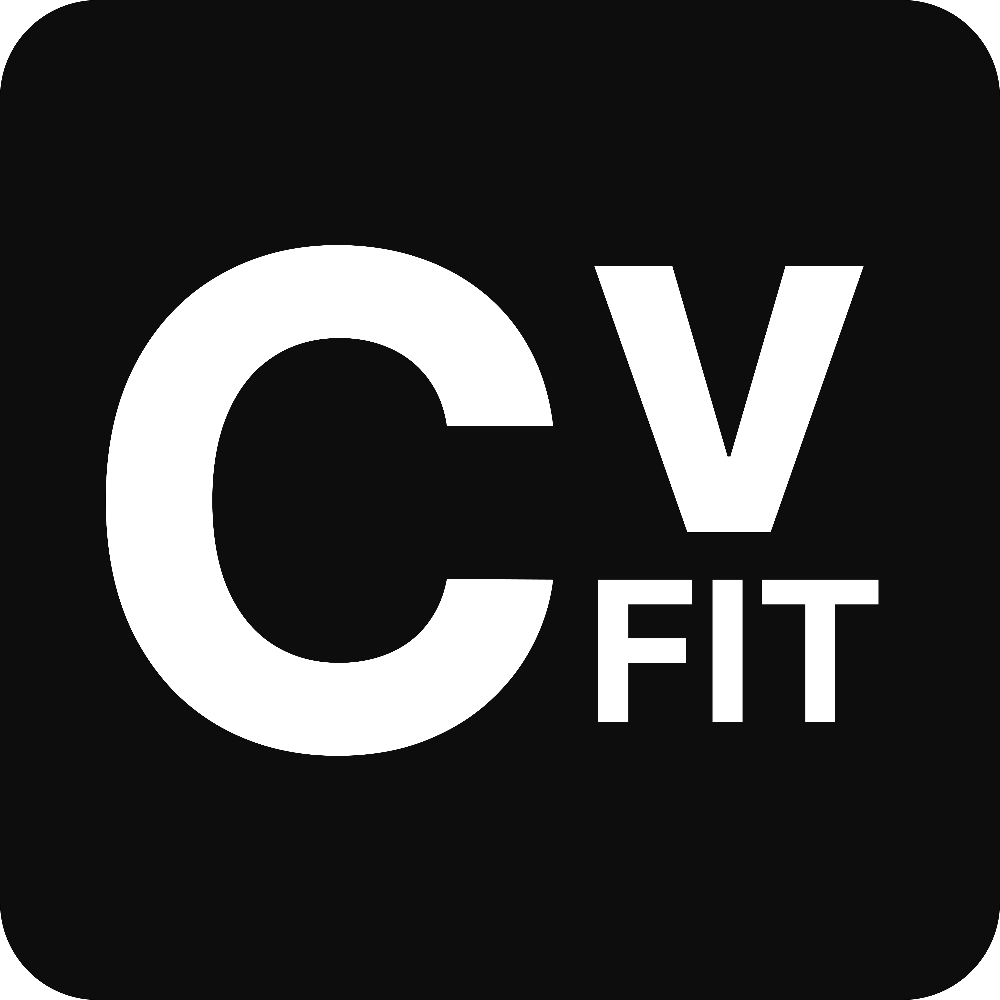

<p align="center">
  
</p>

# CVFit: Computer Vision Fitness Tracker


## Overview

CVFit is an advanced fitness tracking application that uses computer vision and pose detection to track, analyze, and improve your workout experience. Unlike traditional fitness trackers that require wearable sensors, CVFit leverages your computer's camera to monitor your movements, providing real-time metrics, performance analysis, and workout recommendations.

The app focuses on tracking hand/arm movements to estimate running metrics, making it ideal for indoor workouts where GPS tracking isn't available. Using deep learning-based pose estimation, CVFit delivers a comprehensive fitness experience with minimal setup requirements.

## Key Features

### 🏃‍♂️ Real-time Running Metrics

CVFit captures and displays key running metrics in real-time:

- **Speed**: Calculated from arm movements with machine learning algorithms
- **Distance**: Accumulated based on speed over time
- **Step Count**: Detected from rhythmic arm swing patterns during running
- **Duration**: Precise workout time tracking
- **Calories**: Energy expenditure estimation based on speed and duration

### 📊 Advanced Performance Analysis

The system evaluates several performance dimensions:

- **Stability Score**: Measures the consistency of vertical arm movements
- **Form Analysis**: Evaluates running form by analyzing arm symmetry
- **Efficiency Measurement**: Combines speed and cadence data for overall movement efficiency
- **Consistency Rating**: Tracks variability in pace throughout the session

### 🔍 Pose Detection Technology

- Hand-focused tracking for greater privacy and performance
- Real-time visual feedback with arm/hand keypoint visualization
- Efficient processing optimized for standard webcams

### 📈 Progress Tracking

- Session summaries with key performance metrics
- Historical data tracking across multiple sessions
- Visual performance trends through time-series graphs

### 📦 Cross-Platform Support

- **Windows**: Native executable with installer
- **macOS**: Native .app bundle with DMG installer
- **Linux**: AppImage and tarball distribution
- **Automatic releases**: Built and distributed through GitHub Releases

## Technical Approach

### Pose Estimation

CVFit employs YOLOv8 for efficient pose estimation, specifically focusing on hand/arm tracking:

- **Model**: YOLOv8n-pose, a lightweight model optimized for real-time inference
- **Keypoints**: Tracks shoulders (5,6), elbows (7,8), and wrists (9,10)
- **Confidence Threshold**: Only uses keypoints with confidence > 0.5 for reliable metrics

### Metrics Calculation

#### Speed Calculation
Speed is derived from arm movement patterns and cadence:

```
speed = arm_movement_speed * 0.7 + (cadence / 160.0) * 2.0
```

Where:
- `arm_movement_speed` is calculated from the displacement of wrist keypoints
- Pixel-to-meter ratio is calibrated based on frame height
- Cadence factor adjusts based on steps per minute

#### Step Detection Algorithm
Steps are counted by identifying the characteristic arm swing patterns during running:

```python
# Simplified representation of the core algorithm
if ((y_vals[1] > y_vals[0] and y_vals[2] > y_vals[1]) or 
    (y_vals[1] < y_vals[0] and y_vals[2] < y_vals[1])) and 
    abs(y_vals[2] - y_vals[0]) > movement_threshold:
    # Step detected
```

The algorithm looks for both "valleys" and "peaks" in wrist vertical position with appropriate cooldown periods to avoid multiple detections of the same step.

#### Calorie Calculation
Calories are estimated using the MET (Metabolic Equivalent of Task) method:

```
calories = (MET × 3.5 × weight_kg) / (200 × 60) × seconds
```

Where MET values vary by speed:
- Walking (< 1.5 m/s): 2.5 METs
- Jogging (1.5-2.5 m/s): 7.0 METs
- Running (2.5-4.0 m/s): 10.0 METs
- Fast running (> 4.0 m/s): 12.5 METs

### Performance Metrics

#### Stability Score (0-95%)
```
stability = base_value + left_arm_stability + right_arm_stability
```
Where each arm's stability is calculated by analyzing variance in vertical position.

#### Form Score (0-90%)
Evaluates symmetry between left and right arm movements, with better scores when arms move in opposite directions (negative correlation coefficient).

#### Efficiency Score (0-95%)
Combines speed and cadence factors, with optimal scores in the 160-180 steps/minute range coupled with good speed.

#### Consistency Score (0-95%)
Calculated from the coefficient of variation (CV) of recent speeds:
```
consistency = 50 + 45 * (1 - CV)
```

## Installation and Setup

### Direct Download (Easiest)

Download the latest version for your operating system from our [GitHub Releases](https://github.com/S1D007/CVFit/releases) page:

- **Windows**: Download `CVFit-Windows.zip` (or the installer if available)
- **macOS**: Download `CVFit-macOS.zip` (contains CVFit.app)
- **Linux**: Download `CVFit-Linux.tar.gz` (or AppImage if available)

#### Installation Notes:

- **Windows**: Extract the ZIP or run the installer. You may need to approve security warnings as the app isn't signed.
- **macOS**: Extract the ZIP, move CVFit.app to your Applications folder. Right-click → Open for first run to bypass Gatekeeper.
- **Linux**: Extract the tarball or make the AppImage executable with `chmod +x CVFit-*.AppImage`

### Building from Source

#### Prerequisites

- Python 3.8 or higher
- Webcam or built-in camera
- 4GB RAM minimum (8GB recommended for smoother experience)

#### Quick Setup (Recommended)

For hassle-free setup, we provide convenient setup scripts that handle all installation steps automatically:

##### For macOS/Linux:
```bash
# Navigate to the CVFit directory
cd CVFit

# Make the script executable (if needed)
chmod +x setup.sh

# Run the setup script
./setup.sh
```

##### For Windows:
```powershell
# Navigate to the CVFit directory
cd CVFit

# You may need to allow script execution first
Set-ExecutionPolicy -ExecutionPolicy RemoteSigned -Scope CurrentUser

# Run the setup script
.\setup.ps1
```

These scripts will:
1. Check if Python 3.8+ is installed
2. Create a virtual environment
3. Install all required dependencies
4. Download the YOLOv8 pose detection model
5. Launch the application automatically

#### Manual Installation

If you prefer to install manually, follow these steps:

1. Clone the repository:
```bash
git clone https://github.com/S1D007/CVFit
cd CVFit
```

2. Create and activate a virtual environment:
```bash
python -m venv env
source env/bin/activate  # On Windows: env\Scripts\activate
```

3. Install required packages:
```bash
pip install -r requirements.txt
```

4. Download the pose detection model:
```bash
python download_model.py
```

#### Running the Application Manually

If you didn't use the setup scripts, start the application with:

```bash
python cvfit.py
```

### Building Executables

You can build standalone executables for your platform:

#### For macOS:
```bash
chmod +x build_macos.sh
./build_macos.sh
```
This creates a `CVFit.app` in the `dist` folder and optionally a DMG installer.

#### For Windows:
```powershell
.\build_windows.ps1
```
This creates executables in the `dist\CVFit` folder and optionally a setup.exe installer.

#### For Linux:
```bash
chmod +x build_linux.sh
./build_linux.sh
```
This creates executables in the `dist/CVFit` folder and optionally an AppImage.

## Usage Guide

1. **Launch the application** using one of the methods described above
2. **Select your camera source** and preferred resolution
3. **Click "Start Tracking"** to begin your workout session
4. **Run in place** or on a treadmill while facing the camera
5. **Monitor your metrics** on the dashboard in real-time
6. **Click "Stop Tracking"** when finished to save your session

## Technical Architecture

CVFit follows a modular architecture:

- **Core**: Fundamental components for pose detection and motion analysis
  - `pose_engine.py`: YOLOv8-based pose detection
  - `activity_tracker.py`: Converts pose data to fitness metrics
  - `motion_analyzer.py`: Analyzes movement patterns

- **GUI**: User interface components
  - `app.py`: Main application window and UI logic

- **Services**: Backend services for data handling
  - `analytics_service.py`: Session data storage and analysis
  - `recommendation_service.py`: Workout recommendations based on performance
  - `pose_service.py`: WebSocket-based pose data processing

- **Utils**: Helper utilities
  - `pose_utils.py`: Mathematical utilities for pose processing
  - `video_capture.py`: Thread-safe video capture

- **Build System**: Cross-platform executable generation
  - `build_macos.sh`: macOS app bundle and DMG creation
  - `build_windows.ps1`: Windows executable and installer creation 
  - `build_linux.sh`: Linux binary and AppImage creation
  - GitHub Actions workflows for automated releases

## Limitations and Constraints

- **Camera Angle**: Requires a clear front view for accurate tracking
- **Lighting Conditions**: Best performance under good lighting
- **Clothing**: Loose or baggy clothing may affect pose detection accuracy
- **Calibration**: Speed calculations are approximate and may require individual calibration
- **Privacy**: While focusing on hands only, still requires camera access
- **Processing Power**: May affect performance on low-end systems

## Contributing and Development

### Creating GitHub Releases

CVFit uses GitHub Actions to automatically build executables for all platforms when a new release is created:

1. Tag your release: `git tag v1.0.0 && git push --tags`
2. Create a release on GitHub using the tag
3. GitHub Actions will automatically build Windows, macOS, and Linux executables
4. The executables will be attached to the release for easy download

### Development Workflow

1. Fork the repository
2. Create a feature branch: `git checkout -b feature/my-feature`
3. Make your changes
4. Run tests: `pytest`
5. Submit a pull request

## Future Improvements

### Near-Term Enhancements

- **User Profiles**: Personalized tracking with user-specific parameters
- **Calibration Wizard**: Guide users through customized calibration for more accurate metrics
- **Export Functionality**: Allow exporting workout data to common fitness platforms
- **Voice Feedback**: Audio cues and coaching during workouts

### Long-Term Vision

- **Additional Workout Types**: Support for strength training, yoga, and HIIT exercises
- **Full-Body Analysis**: Optional full-body tracking for comprehensive form analysis
- **Multi-Person Support**: Track multiple users simultaneously
- **Mobile App Version**: Port to mobile platforms for greater accessibility
- **AI Coaching**: Personalized workout recommendations and form corrections
- **VR/AR Integration**: Immersive workout experience with virtual environments

## Acknowledgments

- YOLOv8 team for the pose estimation model
- OpenCV community for computer vision tools
- All contributors and testers who have helped improve CVFit

---

<p align="center">
  
  
  
  
</p>

<p align="center">
  <a href="#"></a>
  <a href="#"></a>
  <a href="#"></a>
</p>